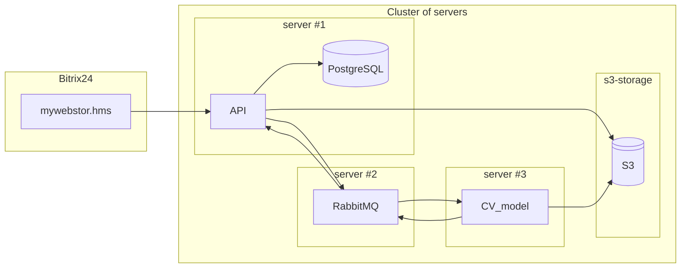

## Architecture



## Launch

### Preparatory stage

1. It is necessary to create a `.env` file with the following contents in the root directory of the cloned repository:
    ```.env
    DEBUG=False

    # Database
    DB_HOST=
    DB_PORT=
    DB_NAME=
    DB_USER=
    DB_PASSWORD=

    # AWS
    AWS_URL=
    AWS_BUCKET= 
    AWS_ACCESS_KEY=
    AWS_SECRET_KEY=
    AWS_REGION=

    # Message Broker
    MB_URL=
    MB_PORT=
    MB_USER=
    MB_PASSWORD=
    MB_PRODUCER_QUEUE=
    MB_CONSUMER_QUEUE=
    ```

### Запуск docker-compose

Боевая версия

```sh
docker-compose -f docker-compose.yml up --build
```

Developer version

```sh
docker-compose -f docker-compose.override.yml up --build
```

### Database migration

```sh
alembic revision --autogenerate -m "init"
```

```sh
alembic upgrade head
```
